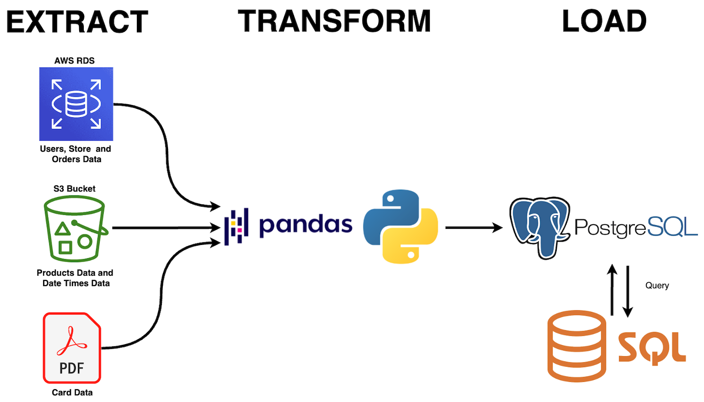

# Multinational-Retail-Data-Centralisation

      </div>

## Table of Contents
- [Multinational-Retail-Data-Centralisation](#multinational-retail-data-centralisation)
- [Description](#description)
- [Installation](#installation)
- [Usage](#usage)
- [File Structure](#file-structure)
- [ERD](#erd)
- [License](#license)

## Description
This is a project looking at the ETL (Extract, Transform, Load) process focusing on data to do with sales. This involves extracting data from a wide range of sources such as APIs, AWS S3 bucket, CSV files and pdf and preparing the data by cleaning and performing transformations such as converting to the correct dtype or making the format of columns with similar data more uniform.



## Process

1. Extraction: Extract data from different sources, including CSV files, an API, AWS S3, and an AWS RDS database.

2. Transformation: transforming (and cleansing) the extracted data to make sure there consistency and it is compatible with a destination.

3. Loading: loading the cleansed data to the destination in this case sales_data PostgreSQL database.

## Installation
1. Clone the project repository from GitHub.

   Clone the repository:

   ``` bash
   git clone https://github.com/your-username/your-repository.git
   cd your-repository

   ```
1. Install the dependencies:

   Ensure you have necessary dependencies installed. You can install them using the following command:

   ```
   pip install -r requirements.txt

   ```
1. Set up database credentials:

   Create a db_creds.yaml file with your PostgreSQL credentials.
## Usage
Run the project using the instructions provided in the "Installation" section.

You can run the program via the viewdataframe.ipynb file
## ERD

Entity Relationship Diagram of database<br>


## File Structure
    .
    ├── Images
    │   └── ERDiagram.png
    ├── README.md
    ├── data_cleaning.py
    ├── data_extraction.py
    ├── database_utils.py
    ├── db_creds.yaml
    ├── products.csv
    ├── queries.sql
    └── viewdataframes.ipynb

## License

