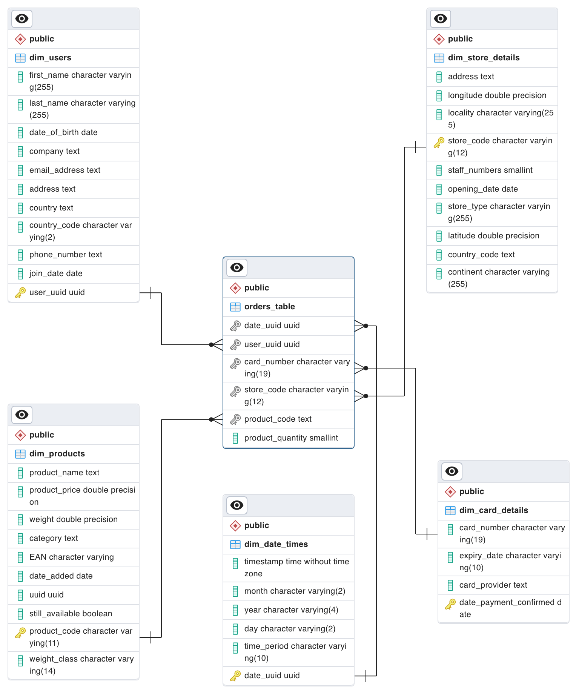

 # Multinational Retail Data Centralisation

      </div>

### Table of Contents
 - [Description](#description)
 - [The ETL Process](#the-etl-process)
 - [ERD](#erd)
 - [Installation Instructions](#installation-instructions)
 - [Usage](#usage)
 - [SQL Queries](#sql-queries)
 - [File Structure](#file-structure)

### Description
***
This project centers on the ETL (Extract, Transform, Load) process, with a specific focus on sales-related data. It involves extracting data from a diverse array of sources including `APIs`, `AWS S3 buckets`, `CSV files`, and `PDFs`. Subsequently, the data undergoes thorough preparation, encompassing cleaning and transformation tasks such as standardizing data types and ensuring uniform formatting across columns with similar data. The processed data is then loaded into a centralized `PostgreSQL` database.

The overarching goal of this project is to streamline data management by consolidating disparate data sources into a single, centralized repository. By establishing a unified source of truth for all sales-related data, the project facilitates easy access and comprehensive analysis, thereby fostering a data-driven decision-making culture within the organization.


### The ETL Process
***
Here is the outline of the ETL Process.<br>


1. `Extraction`: Extract data from various sources, including CSV files, APIs, AWS S3, and an AWS RDS database.
2. `Transformation`: Transform the extracted data to ensure consistency and compatibility with the destination. Tasks includes cleaning, converting data types, aggregating, and performing calculations.
3. `Loading`: Load the cleansed data into the destination, in this case, the sales_data PostgreSQL database.

### ERD
***
An Entity Relationship Diagram for this database, sourced from pgAdmin4.<br>



### Installation Instructions
***
1. Clone the project repository from GitHub

   Clone the repository:

   ``` bash
   git clone https://github.com/hameed0380/multinational-retail-data-centralisation212.git
   cd multinational-retail-data-centralisation212
   ```
2. Install the dependencies

   Ensure you have necessary dependencies installed. You can install them using the following command:
   ```
   pip install -r requirements.txt
   ```
3. Set up database credentials:
   - Make sure PostgreSQL is set up and running.
   - Set up a database named sales_data.
   - Create a db_creds.yaml file with your PostgreSQL credentials.
  
### Usage
***
- **data_extraction.py:** Contains the DataExtractor class, responsible for extracting data from various sources such as CSV files, APIs, AWS S3, and databases.

- **data_cleaning.py:** Contains the DataCleaning class, which handles the cleaning and transformation of extracted data to ensure consistency and compatibility with the destination database.

- **database_utils.py:** Includes the DatabaseConnector class, which manages database connections and facilitates the uploading of data to the PostgreSQL database using pgAdmin.

- **queries.sql:** Contains SQL scripts for modifying and defining the database schema. Utilizes a star schema, where the orders_table serves as the fact table. Also includes queries to extract useful insights from the database.

- **viewdataframes.ipynb:** Main script providing a comprehensive view of the project. Enables analysis of data tables as dataframes, allowing thorough examination of the data in its original state and after any modifications have been applied.


Run the project using the instructions provided in the "Installation" section.
You can run the program via the viewdataframe.ipynb file by running each cell.

### SQL Queries
***
The project also contains a file with a series of SQL queries in the SQL folder called **queries.sql**. The first section of the file contains queries that alter tables, like changing data types, adding primary and foreign keys. The second section of the file contains queries for extracting insights from the data, such as finding out how certain types of store are performing in a particular country or which months produce the highest volume of sales.

#### Example Queries
**How many stores does the business have and in which countries?**

Query:
```sql
SELECT country_code,
        COUNT(store_code)

FROM dim_store_details
GROUP BY country_code;
```

Output:
| country_code | count |
|--------------|-------|
| US           | 34    |
| GB           | 266   |
| DE           | 141   |


**What percentage of sales come through each type of store?**

Query:
```sql
SELECT dim_store_details.store_type,
        SUM(orders_table.product_quantity * dim_products.product_price) AS total_sales,
        ROUND(SUM(orders_table.product_quantity) * 100.0 / SUM(SUM(orders_table.product_quantity)) OVER (), 2) 

FROM orders_table
INNER JOIN dim_store_details on dim_store_details.store_code=orders_table.store_code
INNER JOIN dim_products on dim_products.product_code=orders_table.product_code
GROUP BY dim_store_details.store_type
```

Output:
| store_type   | total_sales       | round |
|--------------|-------------------|-------|
| Local        | 3440896.519999819 | 44.89 |
| Mall Kiosk   | 698791.6099999978 | 8.88  |
| Outlet       | 631804.8099999994 | 8.14  |
| Super Store  | 1224293.6499999806| 15.72 |
| Web Portal   | 1726547.0499999532| 22.36 |


### File Structure
***
    .
    ├── Images
    │   ├── ERDiagram.png
    │   └── MRDC-GRAPH.png
    ├── README.md
    ├── SQL
    │   └── queries.sql
    ├── data_cleaning.py
    ├── data_extraction.py
    ├── database_utils.py
    ├── db_creds.yaml
    ├── requirements.txt
    └── viewdataframes.ipynb

